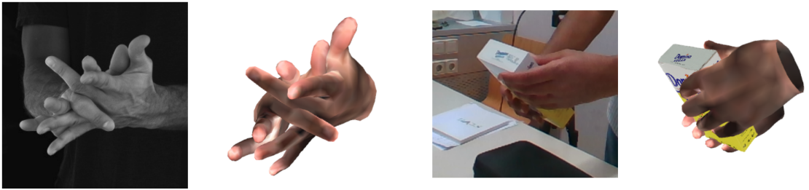
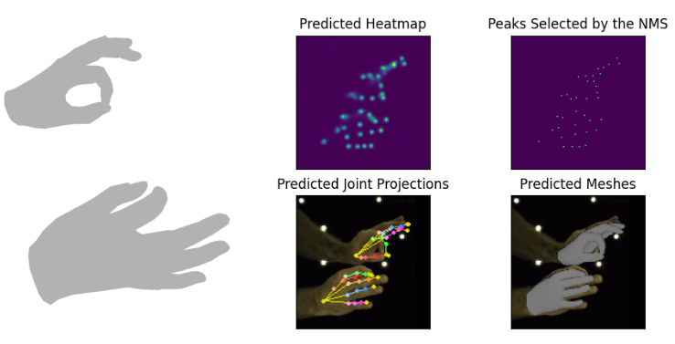
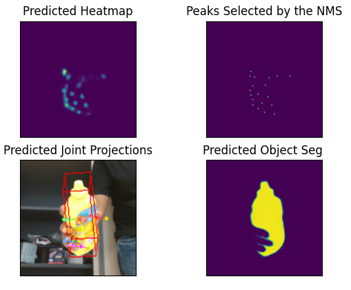

# Keypoint Transformer: Solving Joint Identification in Challenging Hands and Object Interactions for Accurate 3D Pose Estimation

## Overview
* This repo is the official Pytorch implementation of [**Keypoint Transformer: Solving Joint Identification in
Challenging Hands and Object Interactions for Accurate 3D Pose Estimation**](https://arxiv.org/pdf/2104.14639.pdf) accepted
at **CVPR'22 (Oral)**
* The dataset contains Evaluation and Training scripts for the network introduced in the paper using different datasets.



## Installation and Setup

1. Setup the conda environment 
    ```
    conda create --name kypt_trans python==3.8.11
    conda activate kypt_trans
    conda install pytorch==1.10.1 torchvision==0.11.2 torchaudio==0.10.1 cudatoolkit=11.3 -c pytorch -c conda-forge
    pip install -r requirements.txt
    ```
    
2. Download MANO model files from the [website](https://mano.is.tue.mpg.de/) 
(requires login) and set the `smplx_path` in `config.py`

3. Clone the Current Repo
    ```
   git clone <curr_repo>
   cd kypt_trans
   cd main
    ``` 
    
The setup has been tested on NVIDIA 3090 GPU.

Depending on the dataset you intend to train/evaluate follow the instructions below for the setup.
#### InterHand2.6M Setup
1. Download the dataset from the [website](https://mks0601.github.io/InterHand2.6M/)
2. In `config.py`, set `interhand_anno_dir` to point to the annotations directory
3. In `config.py`, set `interhand_images_path` to point to the images directory
4. If you intend to use [RootNet](https://github.com/mks0601/3DMPPE_ROOTNET_RELEASE) output for the 
root joint translation, download the RootNet results for InterHand2.6M from [here](https://github.com/facebookresearch/InterHand2.6M#results). 
Set `root_net_output_path` in `config.py` for point to the RootNet outputs folder. 
Instead, if you intend to test with ground-truth relative translation, set `root_net_output_path` to `None`

#### HO-3D Setup
1. Download the dataset from the [website](https://www.tugraz.at/institute/icg/research/team-lepetit/research-projects/hand-object-3d-pose-annotation/)
and set `ho3d_anno_dir` in `config.py` to point to the dataset folder
2. Download the YCB models from [here](https://github.com/shreyashampali/ho3d?#basic-setup). The original mesh models are large and wont fit in the memory
for some computation. Because of this the mesh decimated to 2000 faces as described [here](https://github.com/hassony2/handobjectconsist/issues/14#issuecomment-713606479). Rename the
decimated models as `textured_simple_2000.obj`


#### H<sub>2</sub>O-3D Setup
1. Download the dataset from the [website](https://www.tugraz.at/index.php?id=57823)
and set `h2o3d_anno_dir` in `config.py` to point to the dataset folder.
2. Follow step 2 in HO-3D Setup above to download, decimate and set the object models.

## Demo
We provide the demo script for visualizing the outputs.
#### InterHand2.6M
1. Download the checkpoint file for the model trained to output MANO joint angles from [here](https://1drv.ms/u/s!AsG9HA3ULXQRgskO89bIy8j3h-HTXQ?e=J6FHVu)
2. Set `dataset = 'InterHand2.6M'` and `pose_representation = 'angles'` in `config.py`
3. Run the following script:
    ```
    python demo.py --ckpt_path <path_to_ckpt> --use_big_decoder --dec_layers 6
    ```
4. The outputs are shown in matplotlib and open3d windows. See the instructions in the command line to navigate



#### HO-3D
1. Download the checkpoint file for the model trained to output 3D pose representation from [here](https://1drv.ms/u/s!AsG9HA3ULXQRgskPefU5ZyiGvgWEVw?e=h1yiNM)
2. Set `dataset = 'ho3d'` and `pose_representation = '3D'` in `config.py`
3. Run the follwing script:
    ```
    python demo.py --ckpt_path <path_to_ckpt> --use_big_decoder --dec_layers 6
    ```
4. Since the output here is only 3D joint locations, the projections in 2D are shown in the matplotlib window. See the instructions in
the command line to navigate.



## Evaluation
Depending on the dataset you intend to evaluate follow the instructions below.

#### InterHand2.6M (Table 1 in Paper)
1. Make the following changes in the `config.py` 
    ```
    dataset = 'InterHand2.6M'`
    pose_representation = '2p5D' # Table 1 in paper uses 2.5D pose representation
    ``` 
2. Download the checkpoint file from [here](https://1drv.ms/u/s!AsG9HA3ULXQRgsh38J5YoCaV76hICw?e=fP5jaJ)
3. Run the following command:
    ```
    python test.py --ckpt_path <path_to_interhand2.6m_ckpt> --gpu_ids <gpu_ids>
    ```
    If running on multiple GPUs, set `<gpu_ids>` to `0,1,2,3` 
4. The error metrics are dumped into a .txt file in the folder containing the checkpoint

5. Final numbers as below:

[[Results txt file]](https://1drv.ms/t/s!AsG9HA3ULXQRgskIIuhkNOf2rnnEzA?e=NabzE2)

| Single Hand MPJPE (mm) | Interacting Hands MPJPE (mm) | All MPJPE (mm) | MRRPE (mm) |
| ----------- | ----------- | ----------- | ----------- |
|    10.88    | 14.16       | 12.62 | 29.50 |

#### HO-3D (v2) (Table 2 in Paper)
1. Make the following changes in the `config.py` 
    ```
    dataset = 'ho3d'
    pose_representation = '3D' # Table 2 in paper uses 3D pose representation
    ``` 
2. Download the checkpoint file from [here](https://1drv.ms/u/s!AsG9HA3ULXQRgsh4PGfVgmiTiwhCpw?e=IZWSgM)
3. Run the following command:
    ```
    python test.py --ckpt_path <path_to_ho3d_ckpt> --use_big_decoder --dec_layers 6
    ```
4. The object error metric (MSSD) is dumped into a .txt file in the folder containing the checkpoint
5. Also dumped is a .json file which can be submitted to the [HO-3D (v2) challenge](https://codalab.lisn.upsaclay.fr/competitions/4318) after zipping the file
6. Here is the dumped results file after the run: [[Results txt file]](https://1drv.ms/t/s!AsG9HA3ULXQRgskKj_FxMhh-8Drk4g?e=9Ik6T7)
7. Hand pose estimation accuracy in the HO-3D challenge leaderboard: [here](https://codalab.lisn.upsaclay.fr/competitions/4318#results), user: *bullet*
 
 
#### H<sub>2</sub>O-3D
1. Make the following changes in the `config.py` 
    ```
    dataset = 'h2o3d'
    pose_representation = '3D' # h2o3d results in paper uses 3D pose representation
    ``` 
2. Download the checkpoint file from [here](https://1drv.ms/u/s!AsG9HA3ULXQRgsh5ecI_5qyeU_0MYg?e=Ipm2KV)
3. Run the following command:
    ```
    python test.py --ckpt_path <path_to_h2o3d_ckpt>
    ```
4. The object error metric (MSSD) is dumped into a .txt file in the folder containing the checkpoint
5. Also dumped is a .json file which can be submitted to the
 [H<sub>2</sub>O-3D challenge](https://codalab.lisn.upsaclay.fr/competitions/4897) after zipping the file.
6. Here is the dumped results file after the run: [[Results txt file]](https://1drv.ms/t/s!AsG9HA3ULXQRgskJjZ7F6n_m4dmaeA?e=5lvte5)
7. Hand pose estimation accuracy in the H<sub>2</sub>O-3D challenge leaderboard: [here](https://codalab.lisn.upsaclay.fr/competitions/4897#results), user: *bullet*
 
 
## Training
1. Depending on the dataset and output pose respresentation you intend to train on, set the `dataset` & `pose_representation` variables in 
the `config.py`.
2. Run the following script to start the training:
    ```
    CUDA_VISIBLE_DEVICES=0,1 python train.py --run_dir_name <run_name>
    ```
    To continue training from the last saved checkpoint use `--continue` argument in the above command.
3. The checkpoints are dumped after every ecoch in the 'output' folder of the base directory
4. Tensorboard logging is also available in the 'output' folder

##### Training with HO-3D and H<sub>2</sub>O-3D datasets together
The H<sub>2</sub>O-3D results in the paper are obtained by training the network on the combined dataset
of HO-3D and H<sub>2</sub>O-3D. This training can be achieved by setting `dataset` to
`ho3d_h2o3d` in `config.py`.


## Reference
    
        @InProceedings{Hampali_2022_CVPR_Kypt_Trans,  
        author = {Shreyas Hampali and Sayan Deb Sarkar and Mahdi Rad and Vincent Lepetit},  
        title = {Keypoint Transformer: Solving Joint Identification in Challenging Hands and Object Interactions for Accurate 3D Pose Estimation},  
        booktitle = {IEEE Computer Vision and Pattern Recognition Conference},  
        year = {2022}  
        }  
        
## Acknowlegements
* A lot of the code has been reused from [InterHand2.6M](https://github.com/facebookresearch/InterHand2.6M) repo and the
[DETR](https://github.com/facebookresearch/detr) repo. We thank the authors for making their code public
    